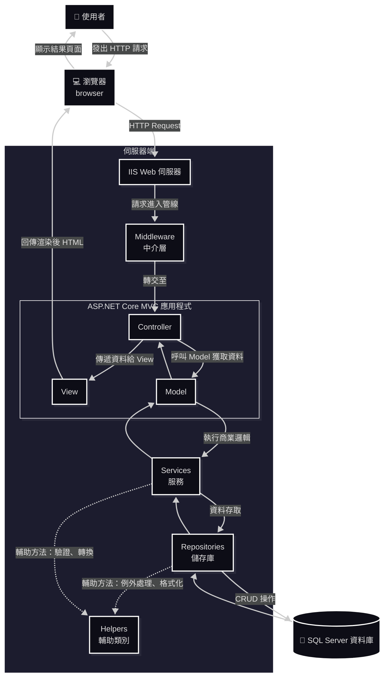
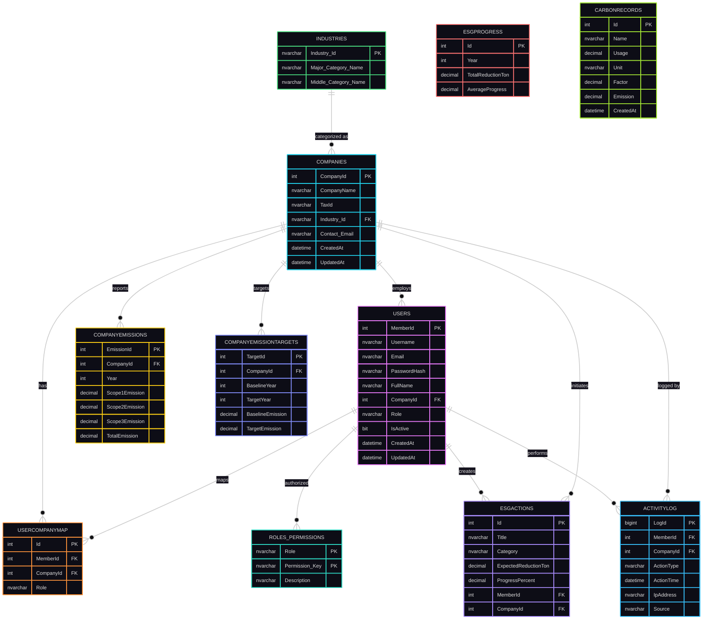

<a name="README"></a>
<p align="center">
  
</p>  

# 🌿 AI 家庭財務平台

> # AI Family Finance Platform


---

## Project Overview

AI Family Finance Platform 是一套以 **家庭財務管理** 為核心的智慧化平台。

系統透過電子發票 QR Code、OCR 與大型語言模型（LLM）自動解析發票內容，建立可分析的家庭消費資料，協助使用者完成分類、預算管理、消費分析與報表匯出。

本專案採用 Domain-Driven Design（DDD）與 Layered Architecture 作為核心設計理念，所有功能皆以可持續擴充與高維護性為目標。

---

## Architecture

目前平台採用五層架構。

```
Presentation Layer
        │
Application Layer
        │
Domain Layer
        │
Infrastructure Layer
        │
Service Layer
```

---

## Current Development Stage

目前開發階段：

- ✅ Architecture Blueprint v1
- ⏳ Sprint 1 - Platform
- ⏳ Sprint 2 - Master Data
- ⏳ Sprint 3 - Invoice Engine
- ⏳ Sprint 4 - AI Pipeline
- ⏳ Sprint 5 - Analytics

---

---

## 🧭 專案資訊 (Project Information)
| 分類 | 說明 |
|------|------|
| **專案名稱** | AI 家庭財務平台 |
| **開發框架** | Python |
| **資料庫** | SQL Server / SQLAlchemy |
| **主要功能** | 帳戶管理、發票管理、AI 智慧分析、基礎資料管理、財務分析、報表匯出 |
| **開發者** | 徐秉群 (Allen Hsu) |
| **版本** | v1.0.0 |
| 線上 Demo | [carbornprojectwebpractice.somee.com](https://carbornprojectwebpractice.somee.com/) |

---

<a name="Table_of_Contents"></a>
## 📚 目錄 (Table of Contents)
- [專案簡介](#專案簡介)
- [專案導覽](#專案導覽)
- [專案目標](#專案目標)
- [系統架構](#系統架構)
- [核心模組](#核心模組)
- [系統安全設計](#系統安全設計)
- [資料庫設計（SQL Server）](#資料庫設計)
- [專案亮點](#專案亮點)
- [後續發展建議](#後續發展建議)
- [License](#License)
- [報告與文件](#報告與文件)
- [聯絡資訊](#聯絡資訊)

---
<a name="專案簡介"></a>
## 📖 專案簡介  

## 專案簡介（Project Overview）

**AI Family Finance Platform** 是一套以家庭財務管理為核心的智慧化平台，透過電子發票 QR Code、OCR 文字辨識，將非結構化的消費資訊轉換為可分析的財務資料。

平台提供:
- **發票管理**
- **消費分類**
- **家庭成員歸屬**
- **商店管理**
- **預算追蹤**
- **統計分析**
- **報表匯出**

協助使用者建立完整的家庭記帳流程，提升財務管理效率。

本專案採用**分層架構（Layered Architecture）**與**領域導向設計（Domain-Driven Design, DDD）**作為核心設計理念，並以高內聚、低耦合為原則，建立**易於維護**與**持續擴充**的系統架構。

平台初期以台灣電子發票作為主要資料來源，未來將逐步支援更多財務資料來源，並透過 AI 輔助分類、消費分析與自動化流程，打造完整的家庭財務管理平台。
<p align="right" style="font-size:0.8em;"><a href="#Table_of_Contents">📑 目錄</a></p>  

---
<a name="專案導覽"></a>
## 🧭 專案導覽
<!-- - [第一章《角色權限系統》](docs/01_RolePermissionSystem.md)
- [第二章《使用者認證與註冊系統》](docs/02_UserAuthAndRegister.md)
- [第三章《JWT 記住我功能》](docs/03_JWTRememberMe.md)
- [第四章《Claims-based 認證流程》(Claims-based Authentication Flow)](docs/04_ClaimsBasedAuthenticationFlow.md) -->

---

<a name="專案目標"></a>
## 🧭 專案目標

- 建立完整的**家庭財務管理平台**。
- 自動解析**台灣電子發票**與**紙本發票**內容。
- 降低人工輸入記帳資料的**時間成本**。
- 提供 AI 輔助**消費分類**與**資料校正**功能。
- 支援家庭成員、商店與消費分類等**基礎資料管理**。
- 提供多維度**消費分析**與**預算管理**功能。
- 支援 Excel、Google Sheet 等**報表匯出**格式。
- 建立高內聚、低耦合且**易於維護**的系統架構。
- 採用模組化設計，提升**系統擴充性**與**維護性**。
- 作為 AI 應用於家庭財務管理的**實作**與**研究平台**。
<p align="right" style="font-size:0.8em;"><a href="#Table_of_Contents">📑 目錄</a></p>  

---

<a name="系統架構"></a>
## 🏗️ 系統架構

**技術堆疊（Tech Stack）**
<!-- | 類別 | 技術 |
|------|------|
| Framework | ASP.NET Core MVC 8.0 |
| 語言 Language | C# |
| 資料庫 Database | SQL Server / Azure SQL |
| ORM | Entity Framework Core |
| PDF Engine | iTextSharp |
| 前端 | Razor Views, Bootstrap, Chart.js |
| 驗證服務 Authentication | Claims-Based + Session + JWT |
| Logging | ActivityLog 模組 |
| 部署 | IIS / Azure Web App | -->

**系統流程（簡要示意）**



<p align="right" style="font-size:0.8em;"><a href="#Table_of_Contents">📑 目錄</a></p>  

---

<a name="核心模組"></a>
## 💡 核心模組  

| 模組 | 功能描述 |
|------|-----------|
| 會員登入 / 註冊 | 支援公司與成員帳號，採 Session 驗證 |
| 碳排放紀錄 | 可記錄年度排放量與目標值 |
| 視覺化圖表 | 使用 Chart.js 呈現排放趨勢與比例 |
| 活動紀錄 | 追蹤登入、更新與資料變更 |
| 管理者後台 | 查看全公司資料與平均排放狀況 |

- **會員與權限管理**（Admin / Company / Staff / Viewer）  
- **碳排放記錄與目標**（CompanyEmissions、CompanyEmissionTargets）  
- **ESG 行動管理**（ESGActions、ESGProgress）  
- **活動日誌**（ActivityLog）：操作稽核、IP / User-Agent / CorrelationId  
- **公告系統**（Company 層級）  
- **報表匯出**：PDF（iTextSharp）、Chart.js 視覺化  
<p align="right" style="font-size:0.8em;"><a href="#Table_of_Contents">📑 目錄</a></p>  

---

<a name="系統安全設計"></a>
## 🔐 系統安全設計

- Claims-based 認證 + Session + JWT（可選「記住我」功能）  
- 密碼使用 BCrypt 加密（BCrypt.Net-Next）  
- 帳號鎖定機制：連續失敗 5 次鎖定，30 分鐘自動解鎖  
- CSRF 防護（ValidateAntiForgeryToken）與安全 Cookie（HttpOnly / Secure / SameSite）  
- 角色/權限表（Roles_Permissions）實作 RBAC  
<p align="right" style="font-size:0.8em;"><a href="#Table_of_Contents">📑 目錄</a></p>  

---

<a name="資料庫設計"></a>
## 📀 資料庫設計（SQL Server）  

簡化 ER 圖（主要表格與關聯）：  



<p align="right" style="font-size:0.8em;"><a href="#Table_of_Contents">📑 目錄</a></p>  

---

<a name="專案亮點"></a>
## 🌟 專案亮點


### 🧩 架構設計 Architecture Design

- **ASP.NET Core MVC Framework**  
  採用跨平台、高效能的 ASP.NET Core，具備良好的可維護性與可擴展性。  
  Built on ASP.NET Core, a high-performance and cross-platform web framework for scalable and maintainable applications.

- **Layered Architecture (多層式架構)**  
  將應用分為 Controller、Service、Repository、Model 等層，確保職責分離。  
  Implements a layered architecture to ensure clear separation of concerns between components.

### 💾 資料存取層 Data Access Layer

- **Entity Framework Core (EF Core)**  
  使用 EF Core 進行 ORM 操作，簡化資料庫 CRUD 流程，並支援 LINQ 查詢與 Migration 管理。  
  Utilizes EF Core for ORM-based data access, simplifying CRUD operations and supporting LINQ and database migrations.

- **Repository Pattern**  
  將資料存取邏輯封裝於 Repository，實現資料層與業務邏輯層分離。  
  Encapsulates data access logic within repositories for better abstraction and maintainability.

### 🧠 系統設計 System Design

- **Dependency Injection (依賴注入)**  
  使用 ASP.NET Core 內建的 DI 容器，降低耦合度並提升可測試性。  
  Employs built-in dependency injection to enhance testability and reduce coupling between components.

- **ViewModel Pattern**  
  將資料由 Controller 傳遞至 View，確保資料結構與顯示邏輯分離。  
  Uses ViewModel to transfer data between Controller and View, improving front-end flexibility.

- **Session 狀態管理 (Session Management)**  
  透過 Session 儲存登入使用者資訊（如 MemberId, CompanyId），維持使用者狀態。  
  Manages user sessions to persist authentication and contextual data between requests.

### 📊 系統紀錄與追蹤 System Logging & Auditing

- **ActivityLog 使用者活動紀錄**  
  將使用者操作記錄於資料表中，包括登入、登出、修改、刪除等動作，方便後續稽核與行為分析。  
  Records all user actions such as login, logout, and updates into the ActivityLog table for audit and analysis.

- **IP & User-Agent 追蹤**  
  每筆活動紀錄包含 IP 位址與使用者代理資訊，以提升安全性與可追溯性。  
  Each activity entry stores IP address and User-Agent for enhanced security and traceability.

### 🔐 安全性設計 Security Features

- **角色與權限管理 (Role-Based Access Control)**  
  使用 Roles_Permissions 表實作角色權限控制，確保不同身分的使用者僅能存取對應功能。  
  Implements RBAC (Role-Based Access Control) using the Roles_Permissions table.

- **帳號安全機制 (Account Protection)**  
  支援電子郵件驗證、登入失敗次數限制與狀態鎖定，保障系統安全。  
  Supports email confirmation, login attempt limits, and account locking for enhanced security.


<p align="right" style="font-size:0.8em;"><a href="#Table_of_Contents">📑 目錄</a></p>  

---
<a name="後續發展建議"></a>
## ⌨️ 後續發展建議 


<p align="right" style="font-size:0.8em;"><a href="#Table_of_Contents">📑 目錄</a></p>  

---

<a name="License"></a>
## 📄 授權條款 (License)

此專案僅供學術與內部開發測試用途，未經授權請勿用於商業目的。  

Copyright (c) 2025 Allen Hsu

Permission is hereby granted to use, copy, and modify this software 
for **academic, research, or educational purposes only**, provided 
that proper credit is given to the original author.

Commercial use, redistribution, or modification for profit is 
strictly prohibited without explicit written permission.

THE SOFTWARE IS PROVIDED "AS IS", WITHOUT WARRANTY OF ANY KIND.  
<p align="right" style="font-size:0.8em;"><a href="#Table_of_Contents">📑 目錄</a></p>  

---

<a name="報告與文件"></a>
## 📁 報告與文件  

詳細**功能說明**、**資料庫腳本**與**長篇報告**放在  
docs/  
Report/  
database/  
> [💒 返回頁首](#README)  
  [📑 目錄](#Table_of_Contents)  

---

<a name="聯絡資訊"></a>
## ✉️ 聯絡資訊  

> 開發者：徐秉群 (Allen Hsu)  
  Email：mituteruhsu@gmail.com  
